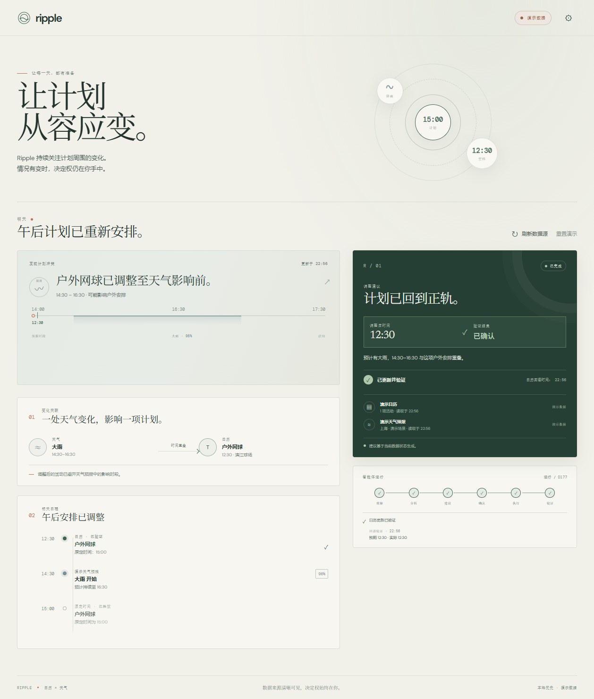

# Ripple

## OctoSense App Hub delivery

The native OctoScript app is in **[bundle/](bundle/manifest.json)**, version **0.1.0**. Entry: [main.splash](bundle/main.splash). It uses app-owned synthetic test schedules and real Open-Meteo weather, with pending proposals, explicit approval and independent storage read-back. Only Windows card-host has been tested. [Privacy notice](PRIVACY.md). [Actual 2:51 native demo](submission/video/Ripple-OctoScript-Demo-v0.1.0.mp4).

This version is unsigned. From the repository root in the prepared local workspace, launch the real visible app:

```powershell
$env:PYTHONUTF8='1'
$env:PYTHONIOENCODING='utf-8'
$env:RUSTUP_TOOLCHAIN='stable'
$env:OCTO_HUB=(Resolve-Path '.host/octo-workspace/OctoSense-App-Hub/target/release/hub.exe').Path
$env:OCTO_CARD_HOST=(Resolve-Path '.host/octo-workspace/OctoSense-App-Hub/target/release/card-host.exe').Path
python .host/octo-workspace/OctoScript-App-Design-Flow/tools/octo doctor
python .host/octo-workspace/OctoScript-App-Design-Flow/tools/octo run bundle --port 8141 --app-data octoscript/.local-state --detach
```

For a fresh checkout, prepare and build the official pinned workspace using the [official Quickstart](https://github.com/OctoSense-org/OctoScript-App-Design-Flow/blob/main/docs/QUICKSTART.md). Exact source revisions and the Windows gate limitation are in [the native runtime notes](octoscript/README.md). Generated check outputs, review packets and runtime data stay outside `bundle/` and Git. Publisher signing and the Hub Issue remain separate delivery steps; a local gate pass and a public Git version are not organizer approval.

Windows runtime launch stamps a platform-specific manifest digest. Re-run the official Linux gate as documented in the runtime notes before committing the final bundle. Source, listing, assets and screenshots are unchanged. The pinned reference card-host does not verify publisher signatures; once a future delivery is signed, run an unsigned preview copy outside the delivery and do not mutate the signed bundle.

`octoscript/bundle/` is the preserved, Git-ignored local prior-stage candidate. **Submit only root `bundle/`.** The existing React files and the dated documentation below remain as historical references.

## Legacy React prototype and earlier competition records

Source repository: [yuandhsh-lang/ripple](https://github.com/yuandhsh-lang/ripple). Maintainer: [yuandhsh-lang](https://github.com/yuandhsh-lang). Support: [repository issues](https://github.com/yuandhsh-lang/ripple/issues). Publication verification is recorded in [COMPLIANCE.md](docs/hackathon/COMPLIANCE.md).

Competition closure review, **2026-10-05: BLOCKED**. Issue #13 is open and requests a real team name plus repository URL; no matching submission comment was found. Registered team details are not supplied or verified. Google Cloud reached its first-use terms screen, but Calendar OAuth, a real event change and read-back have not run. The pinned host's eight source mapping checks passed in an LF checkout; native build lacks MSVC `link.exe`, and the Ripple URL-card journey has not run. These source checks do not establish real runtime acceptance. See [closure evidence](docs/hackathon/evidence/closure-20261005.json).

Ripple is a deterministic agentic calendar workflow that combines calendar state with weather context to detect risky outdoor plans, propose a safer time, require explicit user approval, execute the change, and verify the resulting calendar state.

**Primary scenario: Calendar. Weather: external context signal.**

## What Ripple does and why it is agentic

Ripple reads existing timed events and hourly weather, detects an outdoor-plan conflict, searches for a feasible earlier slot, and presents a concrete pending proposal. This bounded **deterministic agentic workflow** uses explicit rules, with no model API.

**Read → Analyze → Propose → Wait for approval → Execute → Read back → Verify**

Execution includes another read before mutation. Only matching event times and preserved event metadata produce `COMPLETED`. Pending proposals remain separate from confirmed Calendar state.

## Human control and failure handling

Review the original/proposed time, reason and sources, then explicitly approve. Decline or cancel leaves the event unchanged. Consent is bound to the proposal, usable once, and expires after ten minutes. Changed Calendar/weather state or a past suggested slot produces `STALE`, requiring recalculation and fresh approval.

Permission denial, write failure and verification mismatch remain visible. An uncertain write produces `PARTIAL`; **检查结果** reconciles through reads only. Another write needs fresh consent. Browser controls are application safeguards, not a server-side boundary against modified JavaScript.

## Tech stack

React 19.3.0, TypeScript 6.0.3, Vite 8.3.1, Vitest 5.0.2 and oxlint 1.86.0, resolved in `package-lock.json`. Frontend with Calendar/weather adapters; no backend, LLM API or Octos kernel.

## Local setup

Verified runtime: **Node.js 24.14.0, npm 11.9.0**. The declared Node range is `^20.19.0 || >=22.12.0`; other versions were not checked in this run.

From the repository root:

```sh
npm ci
npm run dev
```

Open Vite's printed URL, normally `http://localhost:5173`. Demo needs no credentials or environment file. If Windows reports a locked native binding during installation, stop this project's Vite/test processes and retry. Dependencies, build output and `.host/` are ignored.

## Demo mode

Start with **DEMO DATA**. Reset the demo, choose **查看更改**, review 15:00 outdoor tennis → dry 12:30, then **确认更改**. The mock Calendar writes browser-local sample state and independently reads it back. After 11:45 local time the sample moves to tomorrow. Settings exposes denied permission, failed write, mismatch and stale weather; reset restores the sample.

See [demo rehearsal](docs/DEMO.md). All Calendar screenshots show **demo data**, not real Google Calendar evidence.

## Real integrations

**Open-Meteo: VERIFIED real network read**, 2026-10-04. Keyless geocoding and hourly forecasts provide external context. Precipitation/probability are aligned to the preceding hour; missing intervals cannot become invented dry slots.

**Google Calendar: implemented; NOT VERIFIED end to end.** Google Identity Services browser token authorization uses `calendar.events`, paginated listing, target GET and ETag-conditional PATCH. Tokens remain in memory; expiry requires reconnection. No OAuth client secret is embedded.

For later setup, enable Google Calendar API, configure OAuth consent/test users, create a Web client ID and authorize the exact localhost origin or HTTPS domain. Copy `.env.example` to ignored `.env`, set the **public** `VITE_GOOGLE_CLIENT_ID`, restart Vite, then choose **Connect Google Calendar** in Settings. Vite variables are public browser configuration: never put secrets there. Raw LAN IPs are not eligible production OAuth origins; see [Google's origin rules](https://developers.google.com/identity/protocols/oauth2/javascript-implicit-flow#javascript-origin-validation). Real authorization/read/write/read-back require a separate test-account rehearsal.

## Test commands and production build

```sh
npm test
npm run test:integration
npm run lint
npm run typecheck
npm run build
npm run preview
```

`dist/` is generated and excluded from Git. Preview normally uses `http://localhost:4173`. Current results: [VALIDATION.md](docs/hackathon/VALIDATION.md). Integration tests include mocked Google HTTP; they do not verify real OAuth or Calendar writes. CI runs these checks.

## robrix2 host baseline and Web mini-app path

Host: [OctoSense-org/robrix2](https://github.com/OctoSense-org/robrix2/tree/dev/wechat-octoscript-miniapps), branch `dev/wechat-octoscript-miniapps`, exact commit **`05daf9bdb05fafc6d8f04dcb312a35f1d46a661e`**, recorded in [host-baseline.json](host-baseline.json).

**Current organizer update:** [Rinx baseline guide](https://github.com/gosimfoundation/hackathon-agenticapp26/blob/main/docs/rinx-miniapps.md) names [hagency-org/Rinx](https://github.com/hagency-org/Rinx) and cites this same complete commit. Its existence in Rinx was verified; these are different repositories sharing a commit. Existing checkout unchanged; current Rinx runtime and actual URL-card journey remain unverified.

PowerShell: `./scripts/prepare-host.ps1` prepares project-relative **`.host/robrix2`**, validates the remote/clean tree and exact pin. Host native prerequisites and startup are covered by [upstream instructions](https://github.com/OctoSense-org/robrix2/tree/dev/wechat-octoscript-miniapps). The host is not included in Ripple source.

Use the host's **+ → Share mini app** with a reachable Ripple HTTP(S) URL. Windows opens an external browser; macOS/iOS embed a WebView. The website receives no Matrix account authority. Localhost reaches only its own machine; recipients need an independently reachable server. No deployment or host messages were performed. Ripple is a React/Vite Web mini app, not an OctoScript native app. The pin is not asserted to be an organizer-issued release package.

## Evidence and known unverified areas

**VERIFIED:** local demo; Open-Meteo real network read; automated tests; local desktop browser behavior; 390 × 844 production-preview browser flow. Installation/tests/lint/typecheck/build were rerun for this delivery; browser evidence retains its separate date.

**NOT VERIFIED:** Google Calendar OAuth end to end; real Google write/read-back; robrix2 sender → recipient real-account journey; Android/iOS physical devices; formal submission. Publication and clean-clone status are recorded separately in [COMPLIANCE.md](docs/hackathon/COMPLIANCE.md).

| Actual demo screenshot | Evidence |
| --- | --- |
| Approved and verified | [completed](docs/hackathon/evidence/review-20261004-completed.png) |
| Conflict without a free slot | [no slot](docs/hackathon/evidence/review-20261004-no-slot.png) |
| Failed write | [write failed](docs/hackathon/evidence/review-20261004-write-failed.png) |
| Read-back mismatch | [mismatch](docs/hackathon/evidence/review-20261004-verify-mismatch.png) |
| Changed state | [stale](docs/hackathon/evidence/review-20261004-stale.png) |
| Narrow browser before/after | [mobile](docs/hackathon/evidence/review-20261004-mobile.png), [mobile completed](docs/hackathon/evidence/review-20261004-mobile-completed.png) |



The [functionality review](docs/hackathon/REVIEW_2026-10-04.zh-CN.md) and older evidence remain dated records. Current delivery documents: [COMPLIANCE.md](docs/hackathon/COMPLIANCE.md), [VALIDATION.md](docs/hackathon/VALIDATION.md), [SUBMISSION.md](docs/hackathon/SUBMISSION.md).

## Current limitations

One existing timed event at a time, current local day, one weather city and known outdoor activity terms. Searches 2.5–8 hours earlier in half-hour steps, preserving duration. No event creation/deletion, arbitrary multi-day optimization, continuous background monitoring or notifications. Reload loses workflow history; demo Calendar is browser-local. Real Google access and host execution remain unverified; an earlier Windows host build lacked MSVC `link.exe`.

## License

Registered entrant/team roster remains **NOT VERIFIED**; the source maintainer and intended support channel are linked above. Icon: `public/favicon.svg`. Keep private registration records out of source.

Ripple source: **Apache-2.0**, unmodified standard [LICENSE](LICENSE). Appendix placeholders are instructions, not an invented copyright holder. [Third-party notices](public/third-party-notices.txt) retain runtime MIT notices; upstream host licenses remain intact. See the dated [license audit](docs/hackathon/LICENSE_AUDIT.md).
